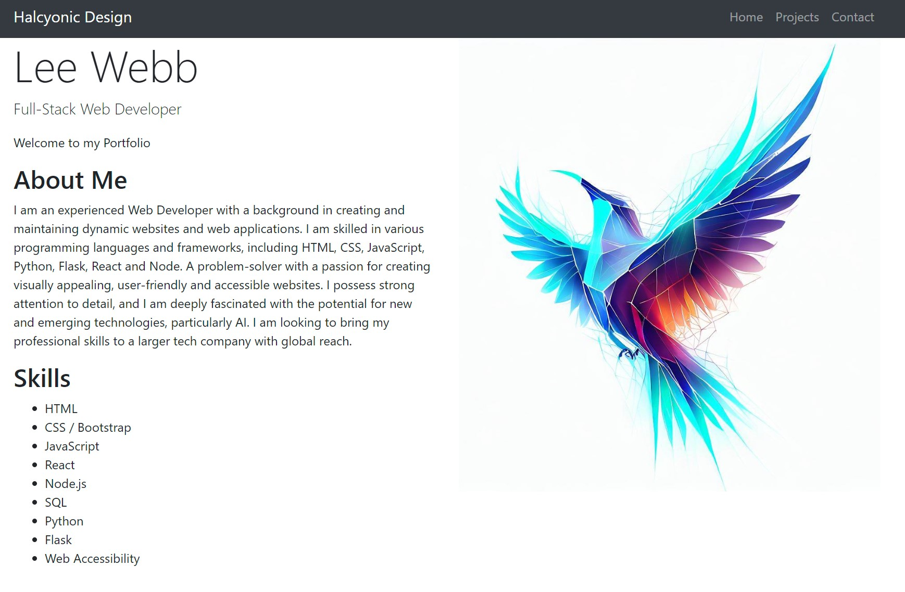
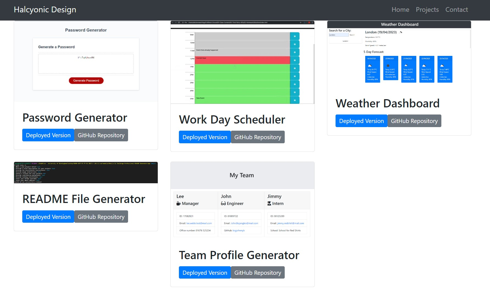
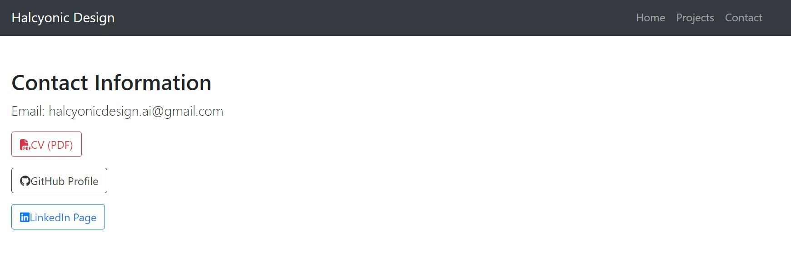

# React-Portfolio

# Module-13-Challenge-React-Portfolio

# Creating a React Portfolio

## Description

I was tasked with recreating my earlier portfolio from the Module 2 and Module 3 Challenges in React, which is far more attractive and a better vehicle to showcase my skills and talents to employers looking to fill full or part-time positons. My portfolio will eventually come to showcase my strongest work and my thought processes behind it. This time I have elected to showcase some projects I have done on this course I am particularly proud of. I will update this with my own work in due time.

I keep in mind that students who have portfolios with deployed web applications (meaning they are live on the web) are typically very successful in their career search after this bootcamp. Having several deployed projects is a minimum requirement to receive an initial interview at many companies.

## Installation
Please visit this URL to see how the website looks now: [https://halcyonlegion.github.io/React-Portfolio/](https://halcyonlegion.github.io/home)

## Usage

Along the top of the page is a Navbar which takes you to different parts of the portfolio. These are driven by components and pages in React. My icon the Halcyonic Bird features on the homepage and has been updated. The nav bar persists across all pages as required, this is how the homepage looks, it contains some about me info, my name and some skills:

The Projects section contains all of what I consider to be my best projects I have built over the course of this Bootcamp. They are presented as cards with pictures, links to deployed pages and repo urls. This format allows for plenty of expansion.

The Contact Me section has links to LinkedIn, Github and my CV, as well as my icon which will allow you to email my business email address halcyonicdesign.ai@gmail.com.

## Credits

Roger Le the Instructor for this Bootcamp as well as the support staff who have provided an incredible amount of support to get us where we are today.

The University of Birmingham provided the materials and guides I used to get this started: https://www.birmingham.ac.uk/index.aspx

License
There is no license specified for this project.
